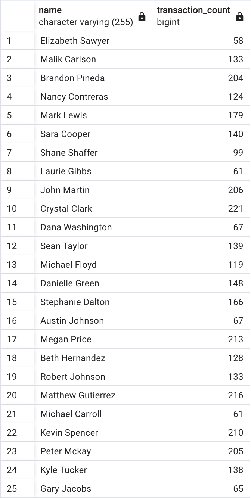

# Module7Challenge

This repository presents an analysis of potential fraudulent transactions in the dataset.

## Analysis

### Isolating Transactions of Each Cardholder

The transactions of each cardholder are isolated using the SQL GROUP BY statement. This allows us to aggregate transactions for each cardholder. See [transaction count by cardholder](./SQL-Solved//trans_count.sql) for the exact query.
