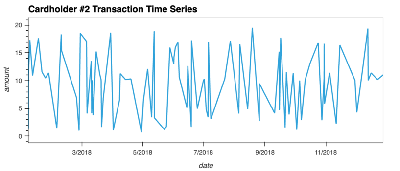
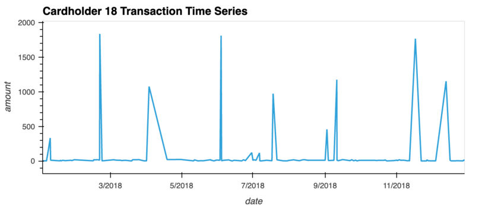

# Module7Challenge

This repository presents an analysis of potential fraudulent transactions in the dataset.

## Analysis--Part 1

### Isolating Transactions of Each Cardholder

The transactions of each cardholder are isolated using the SQL GROUP BY statement. This allows us to aggregate transactions for each cardholder. See [transaction count by cardholder](./SQL-Solved//trans_count.sql) for the exact query.

### Counting Transactions Less Than $2.00 Per Cardholder

The number of transactions that are less than $2.00 per cardholder are counted. See [small transaction](./SQL-Solved/small_trans.sql) for the exact query.

### Identifying Hacked Credit Cards

This is a sorted version of the previous table. See [small transaction sorted](./SQL-Solved/small_trans_sorted.sql) for the exact query.

**Question:** Is there any evidence to suggest that a credit card has been hacked? 

**Answer:** Unusually high numbers of small transactions could be an indication of a hacked card. For exmaple, Megan Price and others might be a victim of credit card frauds.

### Top 100 Highest Transactions Between 7:00 AM and 9:00 AM

The top 100 highest transactions that took place between 7:00 AM and 9:00 AM are analyzed. I also include a view on top 100 highest transactions that took place on the rest of the day. See [small transaction sorted](./SQL-Solved/top_100.sql) for the exact query.

**Question1:** Do you see any anomalous transactions that could be fraudulent?

**Answer:** Examining the screenshot provided above, it's clear that spending over $100 in the early morning is quite unusual. Typically, morning expenditures, such as coffee and breakfast, are significantly less than this amount. So, the first 9 records are anomalous transactions.

**Question2:** Is there a higher number of fraudulent transactions made during this time frame versus the rest of the day?

**Answer:** There is a higher number of fraudulent transactions made during the 7-9 time frame. In the analysis, I conducted two separate examinations to identify abnormal transactions. First, I focused on the early morning timeframe from 7AM to 9AM, during which nine transactions exceeding $100 were noted. Given the typical spending habits in these early hours, these transactions can be deemed unusual.

However, for the remainder of the day, it's not uncommon to see transactions over $100 due to a variety of activities. Therefore, to identify anomalies during this period, I set a higher threshold of $2000. Conventionally, large transactions of this magnitude are conducted via cheque or bank draft, not credit card.

Upon examination of the data set, only 3 transactions were found that crossed this high threshold. These are the transactions that we can potentially categorize as abnormal.

**Question3:** If you answered yes to the previous question, explain why you think there might be fraudulent transactions during this time frame.

**Answer:** Fraudsters often try to make transactions when they believe the cardholder will be less likely to notice. So, during the the 7-9 time frame, there is more fraudulent or abnormal transactions.

### Top 5 Merchants Prone to Small Transactions

The top 5 merchants with the most transactions less than $2.00 are identified. See [top merchants](./SQL-Solved/top_merchant.sql) for the exact query.

All the output `.csv` files are listed below:
[top_100_day.csv](./SQL-Solved/output-file/top_100_day.csv), 
[top_100_morning.csv](./SQL-Solved/output-file/top_100_morning.csv), 
[top_merchant.csv](./SQL-Solved/output-file/top_merchant.csv)

## Analysis--Part 2

### Two important customers 

From the two plots below, it appears that cardholder #2 has a relatively consistent spending pattern, with most transactions falling within the $1 to $20 range. This suggests that this cardholder's spending habits are relatively stable and predictable, which is typical for most individuals.

On the other hand, cardholder #18 exhibits a much more irregular spending pattern. Most transactions are under $20, which is similar to cardholder #2, but there are also instances of unusually high spending that exceeds $1000. This kind of behavior is less typical and could potentially indicate fraudulent activity.

Large transactions are not inherently suspicious as there may be legitimate reasons for them, such as large purchases or payment of bills. However, when these transactions are infrequent and not happen in a fixed time interval, they become more suspicious to me.

### Excessive spending on corporate credit card

It appears that there is at least one outlier in the months of January, March, May. There seems to be 3 outliers in the month of April and June.

The presence of these outliers may indicate unusual or potentially excessive spending activity. In most cases, the transaction amounts for this cardholder#25 are relatively low and consistent, as shown by the "box" part of the box plot. However, the outliers are significantly higher than the typical transaction amounts, which may suggest that these transactions are anomalous.

